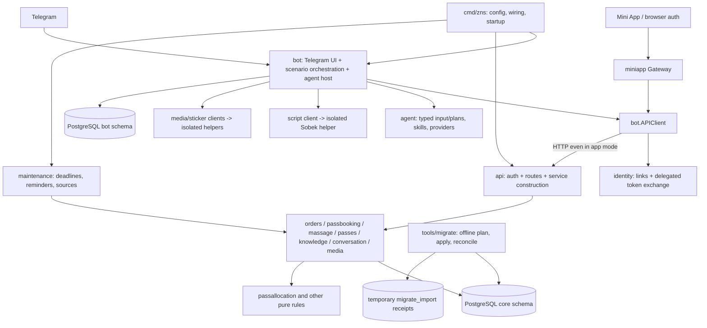
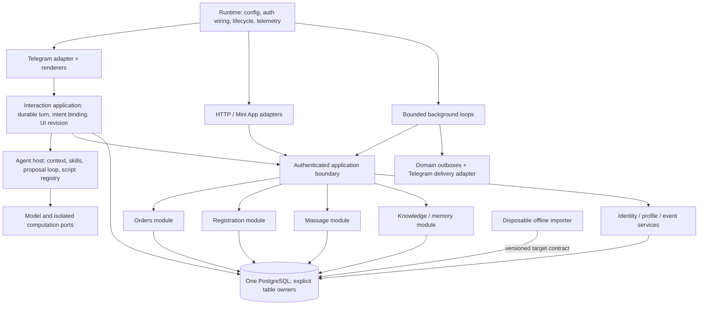

# Архитектурное ревью: куда развивать Go-платформу

Дата: 26 сентября 2026. Объект: текущие исходники `platform` и отдельный `tools/migrate`, с учётом требований `AGENTS.md`, `docs/go-migration.md`, `docs/zitadel-runtime.md` и состояния `PROGRESS.md`.

Это исследование архитектуры, не Code QA stage gate, не Functional QA и не разрешение на рефакторинг. Продуктовые файлы, стенды и данные не менялись. Тесты не запускались. Номера строк относятся к прочитанному рабочему дереву; оно параллельно изменяется. Предыдущие QA-выводы не использованы как доказательство корректности.

## Главный вывод

Платформе нужен **модульный монолит, организованный вокруг прикладных сценариев и владельцев данных**. Большая часть основы уже соответствует этому направлению: PostgreSQL, доменные транзакции, отдельные алгоритмы, предложения модели без полномочий, durable intake, изолированные вычислительные helpers. Переписывать её не требуется.

Главная структурная проблема — неодинаковый смысл границ. `orders/passbooking/massage/knowledge` действительно владеют правилами и транзакциями. `bot` одновременно является Telegram-адаптером, координатором всех пользовательских сценариев, host агента, владельцем UI-состояния и диспетчером доставки. `api` одновременно обслуживает HTTP и собирает почти все доменные сервисы. `core` совмещает начальную booking-fixture, общие ошибки и междоменные чтения. Поэтому новые возможности неизбежно затрагивают одни и те же горизонтальные центры.

**Предпочтение: сначала отделить прикладные сценарии от Telegram и явно определить ownership, затем решать, нужен ли внутренний HTTP.** Замена HTTP сама по себе не устранит связность. Прямой вызов сервисов в обход существующего Zitadel-контракта ухудшит систему.

Наиболее полезны три больших изменения:

1. Вынести управление взаимодействием и агентский host из `bot`, сохранив единые доменные команды для ручного и модельного путей.
2. Сделать доменные модули владельцами команд, запросов, прав и транзакций; адаптеры получают уже собранные зависимости, а `core` перестаёт быть общим местом для несвязанных задач.
3. Отделить runtime lifecycle и доставку от polling loop; закрепить границу disposable importer и исполняемое доказательство его удаления.

## Текущая архитектура

Это логические компоненты. `runApp` уже объединяет основную работу в одном процессе: `platform/cmd/zns/app.go:25`. Старые `api`, `bot`, `model` режимы и split-role Compose существуют параллельно. Их наличие не доказывает нарушение production-требования: это также полезные тестовые адаптеры. Внутренний HTTP выбран явно (`app.go:24`, `app.go:60`), а не случайно остался незамеченным.

## Три целостных варианта

| Вариант | Организация | Выигрыш | Цена и ограничения |
| --- | --- | --- | --- |
| A. Укрепить текущую API-centric схему | `bot` и Mini App остаются API-клиентами; убрать assembly из HTTP; выделить interaction/agent host; домены сохраняются | Минимальный риск для текущей миграции, сохранение delegated-token boundary и существующих стендов | Внутренние JSON/HTTP вызовы, transport DTO и ошибки остаются; нужно следить, чтобы `bot` не вырос обратно |
| **B. Модульный монолит с прикладными портами** | Общие сценарии и доменные сервисы доступны адаптерам через небольшие типизированные контракты; HTTP — один из адаптеров | Самостоятельный агентский host, меньше зависимости интерфейсов друг от друга, единое место сценария, возможность сменить внутренний транспорт | Потребуется перенос durable UI/plan coordination и строгая проверка auth. Это несколько последовательных этапов, не механический rename |
| C. Универсальный command bus / workflow engine | Общий dispatch, registry и декларативное описание каждого workflow | Единая техническая инфраструктура исполнения, удобно при десятках внешних клиентов | Для нынешних неоднородных транзакций возникнут runtime type checks, сложные DSL и универсальные exceptions. Риск новой платформы внутри продукта слишком велик |

Рекомендую **B, достигаемый через A**. Не рекомендую C сейчас. Команды/запросы — полезный общий принцип, но не повод вводить центральный `Execute(any)`, event sourcing, отдельные query-базы или framework.

HTTP можно сохранить даже в конечном B: структура модулей важнее способа передачи вызова. В `docs/zitadel-runtime.md` закреплено получение delegated token для каждого API request. Любая будущая in-process реализация обязана сохранить эквивалентную проверку issuer/audience/actor, связь Telegram→owner, отзыв прав и разделение service/user authority. Удаление exchange или замена его доверенным `owner string` не входит в предлагаемую оптимизацию. Если эквивалентность не доказана, оставить HTTP.

## Предпочтительная целевая схема

`Authenticated application boundary` — принцип и набор обычных Go-функций/сервисов, не обязательный новый пакет-гигант. Каждая команда по-прежнему имеет конкретный Go-тип. Входная identity-проверка общая; решение «может ли этот actor сейчас выполнить эту операцию над этим объектом» остаётся в транзакции соответствующего домена.

Практическая организация: доменные модули `orders`, `registration`, `massage`, `knowledge`; прикладные `interaction`, `assistant`; адаптеры `telegram`, `http`, `zitadel`, `sources`; инфраструктурные `runtime`, `observability`, `store`. Это **карта ответственности**, не приказ немедленно создать все каталоги или по три слоя в каждом модуле. Сначала переносить владельца поведения, затем при необходимости пути.

## Шесть направлений рефакторинга

### 1. Выделить interaction application и агентский host — наибольший структурный выигрыш

**Основание.** `Bot` держит DB, API, Telegram, Model, AV, Scripts и BrowserAuth (`platform/internal/bot/bot.go:31`); dispatch выбирает почти все предметные сценарии (`:164`). Durable `cachedPlan` содержит команды нескольких доменов и Telegram menu state (`:89`). `bindPlanCommands` связывает планы с версиями и командами (`platform/internal/bot/plan_binding.go:9`), а live script registry также принадлежит `Bot` (`platform/internal/bot/script_registry.go:23`). Это больше, чем ответственность транспортного адаптера.

**Изменение.** Отдельный прикладной координатор владеет жизнью входящего turn: восстановление, загрузка доступного контекста, предложение, host binding, сохранение команды, исполнение, результат. Agent host владеет model loop, visibility, scripts и bounded evidence. Telegram владеет parse/callback/markup/send/edit; domain workflows — авторитетным бизнес-состоянием. Durable interaction state сохраняется, не заменяется памятью процесса.

Ручные действия и агентские предложения сходятся **на одной доменной операции**, а не обязаны иметь одинаковый UI workflow. Human confirmation остаётся явным свойством конкретной операции. Pending form остаётся подсказкой агенту, не глобальным перехватчиком текста.

**Границы:** `bot/bot.go`, `plan_binding.go`, `*_agent*`, `script_*`, `agent/Input/Plan`, UI-state persistence. `agent.Input` и `Plan` сейчас широкие объединения предметных данных (`platform/internal/agent/agent.go:34`, `:85`); не заменять их непрозрачным map. Выделять типизированные provider/context projections по реальному сценарию, сохраняя JSON wire contract на переходе.

**Этап:** один вертикальный orders-сценарий после стабилизации его acceptance; затем registration и knowledge. **Трудоёмкость:** L, ориентировочно 2–4 инженерные недели на основную границу и первые переносы; не оценка календарного срока полного проекта. **Риск:** высокий — replay, прерванный model call, привязка версии, старые карточки. **Доказательство:** один и тот же manual→agent→manual сценарий, restart после сохранения плана, stale callback, voice/media continuation, EN/RU, отсутствие раскрытия чужого контекста, обе свежие QA.

### 2. Сформировать модульные прикладные контракты и устойчивую границу полномочий

**Основание.** `AuthenticatedHandler` конструирует почти все сервисы из `core.Service.DB` (`platform/internal/api/api.go:61`). Mini App зависит от конкретного `bot.APIClient` (`platform/internal/miniapp/handler.go:26`). Сам client выполняет identity exchange (`platform/internal/bot/auth.go:79`) и HTTP (`platform/internal/bot/client.go:49`). Поэтому UI зависит от другого UI-модуля, а router знает сборку бизнеса.

**Изменение.** Сборка зависимостей принадлежит runtime. HTTP получает готовые доменные приложения; Telegram, Mini App и agent host используют только нужные им typed commands/queries. Начальный перенос APIClient в самостоятельный адаптер полезен, но недостаточен: основная цель — независимые потребители контрактов. Не создавать интерфейс на каждый service и DTO на каждый слой. Интерфейс нужен у потребителя там, где действительно есть альтернативный transport/provider или полезная test boundary.

**Авторизация.** Visibility для модели и разрешение на исполнение имеют разный смысл. Сохранить оба. `core.Capabilities` и `PrivilegedReads` читают несколько предметных таблиц (`platform/internal/core/capabilities.go:11`, `privileged_reads.go:22`); `agent/capability_visibility.go:126` строит разрешённую схему, а доменные `Execute` повторно проверяют права. В целевой схеме домены публикуют свой live capability/read contract; agent host делает его безопасную проекцию. Общий auth-компонент не должен централизовать все правила всех доменов или превращать ранее прочитанный capability в grant.

**Этап:** начать до завершения миграции с runtime assembly и одного потребителя; решение о direct transport — после. **Трудоёмкость:** M/L, 1–3 недели по выбранному объёму. **Риск:** высокий для identity/ACL, низкий для простого переноса assembly. **Доказательство:** тот же command/query contract через HTTP и новый adapter, revoked Zitadel user, actor mismatch, service-only endpoint, разные event roles, повторная проверка после model/JS read. Производительность HTTP сначала измерить; текущий обзор не доказал bottleneck.

### 3. Установить владельцев данных и транзакций; убрать ложный центр `core`

**Основание.** `core` одновременно содержит generic slots/workflows и общую HTTP-ошибку (`platform/internal/core/core.go:17`, `:40`, `:105`), preferences и междоменные capabilities. Предметные пакеты импортируют его даже только ради `ProblemError`. Но настоящие aggregate boundaries уже существуют: order mutation+capacity+notification+receipt (`platform/internal/orders/service.go:217`), pair mutation+allocation (`platform/internal/passbooking/service.go:45`, `:62`), memory authorization+provenance+replay (`platform/internal/knowledge/service.go:16`).

**Изменение.** Составить ownership: кто пишет users/profile/identity, event configuration, orders/proofs, registrations, massage, knowledge, conversation и interaction UI state. Cross-domain read projections допустимы; чужая запись требует явного сценария и согласованной транзакционной границы. Убрать из общего `core` fixture booking и технический problem contract в соответствующие малые владельцы. Не заменять SQL generic repository и не скрывать порядок блокировок.

Существующие pgx Service могут остаться одновременно application+SQL implementation: для этого проекта это часто проще трёх искусственных слоёв. Pure rules (`platform/internal/passallocation/allocation.go:1`) сохранить отдельно. `passes` — профиль, `passbooking` — регистрация; объединение имён под registration/profile поможет пониманию, но физическое слияние не требуется. Платежи заказов и пассов пока не превращать в общий payment engine: правила попыток, пары, capacity и historical receiver различаются.

**SQL/schema.** Оставить одну последовательность forward migrations. `store.Migrate` уже проверяет checksum и сериализует применение (`platform/internal/store/store.go:43`). Деление Go-модулей не требует отдельных DB schemas. `sqlc` сейчас локален conversation (`platform/sqlc.yaml:1`); расширять только там, где сокращает ручной scan/DTO труд. Generated types не должны становиться публичной моделью всех доменов.

**Этап:** ownership сейчас, переносы стабилизированных доменов позже; не менять lock order вместе с перемещением. **Трудоёмкость:** M, 1–2 недели на карту/общие зависимости и первый модуль; все домены — отдельный план. **Риск:** средний/высокий для транзакций. **Доказательство:** сохранение SQL effects, conflict codes, replay semantics, deadlock/concurrency tests на реальном PostgreSQL. Разные replay semantics нельзя случайно унифицировать: orders возвращают receipt, passbooking читает текущее состояние при совпадении request hash.

### 4. Разделить runtime lifecycle, intake и delivery без распределённой системы

**Основание.** `Bot.Run` под одной session lock последовательно делает polling, reconciliation и все очереди (`platform/internal/bot/bot.go:661`). `drainInbox` останавливается на первом необработанном update (`platform/internal/bot/inbox.go:46`); это создаёт глобальную зависимость прогресса от раннего события. Это наблюдаемая структура и архитектурный риск задержек, не доказанный production incident. Maintenance имеет отдельный lifecycle в cmd (`platform/cmd/zns/api.go:52`, `product_maintenance.go:13`), а delivery снова живёт в bot (`platform/internal/bot/massage_notifications.go:129`).

**Изменение.** Один runtime supervisor владеет запуском, остановкой и ожиданием всех циклов. Intake, processing, view reconciliation, notification delivery, source refresh — явные bounded loops. Начать с выделения lifecycle, сохранив последовательность. Разрешать независимый прогресс разных разговоров только после измерений и проверки ordering; число обработчиков ограничено, порядок внутри conversation сохранён. Single instance не означает один глобальный последовательный workflow.

Общий delivery-компонент может владеть transport outcome, backoff и message IDs; домен сохраняет решение «актуально ли уведомление» и атомарное создание outbox. Не сливать сразу все таблицы очередей: reminder и payment request могут сознательно иметь разные политики неопределённой доставки. Общая библиотека retry без этой семантики опасна.

**Helpers.** Sobek уже отделён от приложения (`platform/cmd/zns/script.go:39`), supervisor запускает ограниченный child (`platform/internal/scriptservice/service.go:1`). Media broker отделяет decoder socket от ASR (`platform/internal/mediaproc/broker.go:29`). Сохранить изоляцию и отсутствие бизнес-полномочий. Контроль helpers при stop/start должен входить в runtime acceptance; не прятать их независимую жизнь за формулировкой «один процесс».

**Этап:** lifecycle после стабилизации runtime; scheduling/concurrency отдельно. **Трудоёмкость:** M/L, 1–3 недели. **Риск:** высокий. **Доказательство:** SIGTERM/hard crash во время intake/commit/send, durable offset, restart, uncertain delivery, fairness при недоступном recipient, второй запуск до полного завершения старого и helpers. Существующая DB lock полезна, но сама по себе не доказывает запрет перекрытия всех maintenance/helpers.

### 5. Сделать importer удаляемым по контракту, а не только по каталогу

**Основание.** `tools/migrate/go.mod:1` — отдельный модуль без runtime dependency. Users preflight до подключения, transaction per user, immutable replay (`tools/migrate/users_apply.go:25`); orders — transaction per event и reconciliation (`tools/migrate/orders_apply.go:22`). Это правильная граница. Цена независимости — явное знание целевой SQL-схемы и дублирование исторических типов (`tools/migrate/orders_contract.go:15`), которое здесь оправдано.

**Изменение.** Зафиксировать target schema/version и dependency manifest импорта: users/identity → events/catalog → owner-bound proof bytes → предметное состояние → reconciliation. Согласовать это с фактическими domain prerequisites; не делать общий runtime import framework. Contract tests проверяют imported DB через обычные runtime APIs. Importer должен сохранять историческое состояние, а не прогонять его через команды, которые переоценивают сегодняшние deadline/queue и создают новые уведомления.

Разделить: временные `migrate_import.*` receipts; постоянные core identity/legacy references; архив snapshot/manifest; runtime compatibility со старыми callback и payment provenance. Удаление importer **не означает** удаление `legacyfood`, callback adapters или исторических ссылок. `platform/internal/store/migrations/055_legacy_pass_references.sql:11` содержит runtime payment metadata, а `tools/migrate/passes_provenance.go:5` сознательно сохраняет только предметную проекцию исходника.

Финальное доказательство удаления: runtime build и representative imported-state tests без каталога/module importer и без его credentials/temporary receipts; затем отдельно проверка того, какие временные таблицы действительно можно удалить. Не изменять применённые SQL migrations для красоты; сохранять историю и forward cleanup.

**Этап:** контракт и границы сейчас, удаление только после parity/import/cutover acceptance. **Трудоёмкость:** M, несколько дней–неделя на контракт и deletion rehearsal, без завершения оставшихся импортов. **Риск:** высокий для данных, низкий для документации контракта. **Доказательство:** source hashes, exact state/drift, resume после частичного commit, proofs unavailable, callback continuity, отсутствие повторной исторической рассылки. Тесты importer сами по себе не доказывают production cutover.

### 6. Сделать QA-инфраструктуру проверкой архитектурных контрактов

**Основание.** Уже есть полезные real-PG scenario tests (`platform/integration/orders_test.go:27`), replay tests (`platform/integration/inbox_test.go:107`), GUI kit (`platform/scripts/fqa/README.md:1`) и независимый importer PG harness (`tools/migrate/users_apply_test.go:24`). Но fixture creation смешана с runtime store (`platform/internal/store/store.go:93`, `orders/service.go:67`), а split/combined runtime имеют разную сборку (`cmd/zns/main.go:71`, `app.go:25`). Это место возможного архитектурного drift.

**Изменение.** Одна product composition; стенд подменяет внешние adapters, добавляет fake Telegram/model и synthetic seed. Отдельные split-role тесты оставить для проверки полномочий. Вынести fixture ownership из production persistence, без переписывания всех интеграционных тестов. Хранить небольшой набор contract scenarios: одинаковые mutation/auth/replay результаты через ручной Telegram, agent host и HTTP; GUI проверяет реальные callbacks/edits/uploads. Не дублировать каждую unit-проверку через все транспорты.

Полезны простые dependency guards: domain не импортирует bot/api; importer не импортируется runtime; HTTP не создаёт SQL service сам; browser не зависит от Telegram orchestration. Только после фактического выделения границ, не как запреты против текущего переходного состояния.

**Этап:** первый contract scenario одновременно с направлением 1; все gates сохраняются. **Трудоёмкость:** M, несколько дней–2 недели по охвату. **Риск:** средний — стенд может перестать моделировать Telegram или замаскировать identity path. **Доказательство:** реальные PG, EN/RU mouse/touch там, где менялся UI путь, независимые Code QA и FQA со frozen stand. Новый внутренний тест не заменяет GUI acceptance.

## Что оставить как есть

- Один основной процесс и один PostgreSQL. Microservices, brokers, distributed leases и active-active здесь не решают поставленную задачу.
- Доменные транзакции с current authorization, version checks и idempotency. Их нельзя переносить в общий middleware без сохранения порядка блокировок и атомарности outbox.
- Модель выдаёт предложения; identity, version и operation key задаёт host. JS helpers не получают DB/token/business authority.
- Конкретные pgx services и небольшие интерфейсы для внешних зависимостей. Не видно необходимости в ORM, DI-container или workflow framework.
- Общие i18n каталоги и locale policy (`platform/internal/i18n/locale.go:11`); JSON error code отдельно от текста. Не переносить локализованные строки в domain mutations.
- Typed config с чистым `Load` (`platform/internal/config/load.go:20`) и redacted Secret (`types.go:17`); явная observability runtime без global provider (`platform/internal/observability/runtime.go:29`) и centralized redaction (`log.go:35`). Эти платформенные компоненты уже имеют полезные границы.
- Source refresh как adapter к knowledge Store (`platform/internal/assistantsource/runner.go:18`), а не часть model provider. Lineup — отдельный read source; не заставлять любую справку проходить через универсальный vector store.
- DTO-копии оправданы на privacy/wire boundaries. `massage.PublicProvider` отделён от internal Provider (`platform/internal/massage/service.go:83`), а conversation использует локальный sqlc mapping (`platform/internal/conversation/read.go:42`). Проблема не в количестве DTO, а в отсутствии понятного владельца и копировании без иной семантики.

Новые библиотеки не требуются для предложенной архитектуры. Значительная часть инфраструктурного кода уже опирается на pgx, sqlc, OTel, oauth2, goldmark и Sobek. Этот обзор не содержит внешней проверки актуальных версий/уязвимостей и не предлагает upgrades. Библиотеку стоит выбирать под подтверждённый повторяющийся механизм, а не под новую диаграмму.

## Порядок работ и отношение к незавершённой миграции

1. **Сейчас:** утвердить целевую ответственность и auth contract, ownership таблиц и importer contract. Зафиксировать, какие текущие candidate проходят acceptance. Не перемещать их файлы параллельно QA.
2. **Закончить текущие проверяемые slices.** Не останавливать перенос всех функций ради глобального переезда каталогов. Закрыть связанные correctness/identity/import defects в существующей структуре.
3. **Первый архитектурный этап:** assembly в runtime + узкий application contract + извлечение одного полного orders interaction. Существующий HTTP и wire формат оставить. Acceptance означает прежнее поведение, не только зелёную компиляцию.
4. **Расширить на registration и knowledge.** Извлечь общий agent host, убрать bot-зависимость Mini App. Только после этого оценить выигрыш от in-process transport. Оптимизация необязательна.
5. **Отдельный runtime этап:** supervisor/delivery и bounded scheduling. Не смешивать его с изменением транзакций/прав или импортом исторических данных.
6. **После полного migration acceptance:** убрать importer и временную инфраструктуру по rehearsal; убрать ставшие ненужными fixture/generic booking пути после подтверждения, что они не нужны активным интерфейсам. Перенести каталоги по ownership только там, где это завершает уже сделанную границу.

Суммировать приведённые интервалы как готовую оценку нельзя: направления перекрываются, независимый QA и исправления могут занимать существенную долю. До первого vertical slice неизвестно, сколько persistent bot state удастся перенести без адаптера совместимости.

## Покрытие и ограничения

Прочитаны composition/config, Core/API/client/auth, Telegram dispatch/durable inbox, agent input/plan/visibility/script host, Sobek supervisor, media broker, доменные command transactions, capability/read projections, knowledge source refresh, identity links, SQL migrations/runner/sqlc, observability/i18n, importer preflight/apply/reconcile/provenance и representative integration/QA infrastructure. Python использован только для понимания исходной структуры: например, `zns-chatbot/plugins/assistant.py:201` одновременно собирает model, DB, QA data и refresh task; это объясняет происхождение части orchestration, но не оправдывает её постоянное размещение в Go bot.

Это полный обзор **границ системы**, а не построчный аудит каждого файла. Не проверены production launcher, live collector, CPU performance, актуальность deployment config, исчерпывающая Python parity, все migration ordering combinations и все ACL гонки. В документе нет утверждения о готовности релиза и нет подтверждённого security bug. Приведённые риски — основания для структурных решений и дальнейшего доказательства. Текущие concurrent migration seams отделены от долгосрочных проблем ownership; transient compile состояния не оценивались.

Written by architecture-review agent (GPT-6/Codex)
on behalf of Daniel Drizhuk
